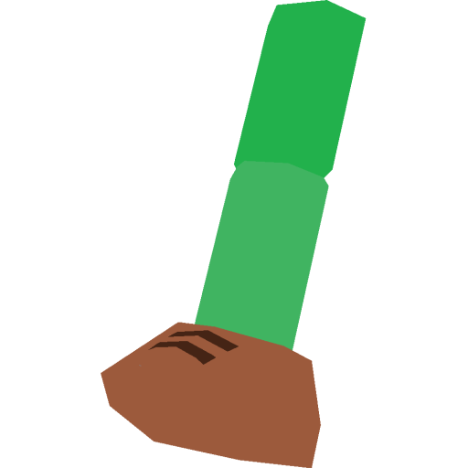
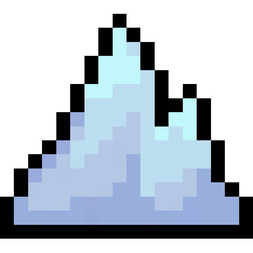
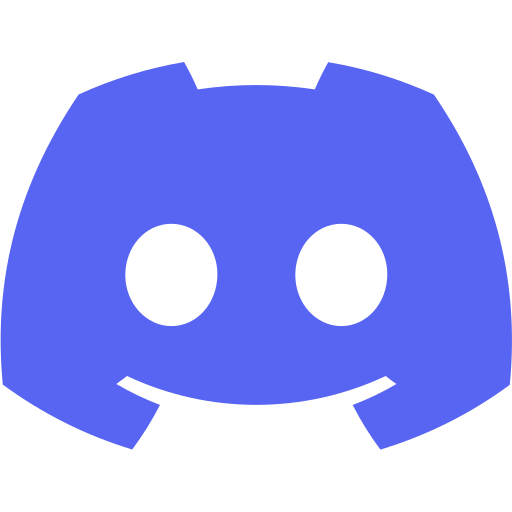
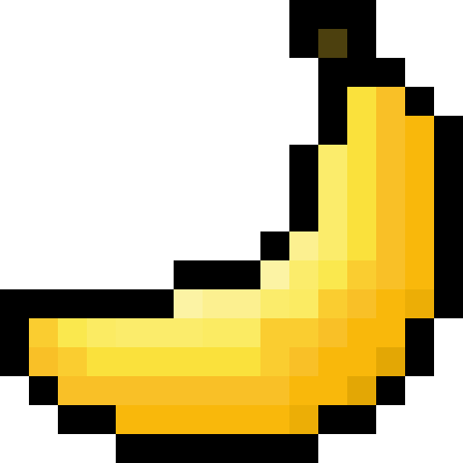
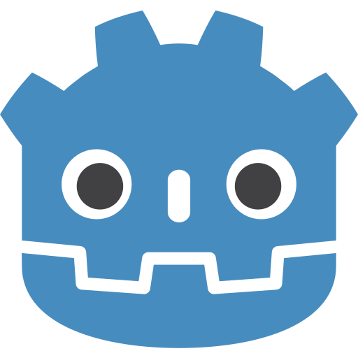

<h1 align="center">Greetings!</h1>
<h3 align="center">I'm Shark. Game developer and modder. I think I'm funny.</h3>

## Games:
-  [Limbless](https://sharkfinface.itch.io/limbless), an ENA-inspired experience made in Godot 3. [Open source](https://github.com/SharkFinFace/Limbless) with [devlogs](https://www.youtube.com/playlist?list=PLl5VMV6zY2AqASPWymuePM4xGJwrou7ak).
## Mods:
-  [Prisonbreak](https://gamebanana.com/mods/493262), a Celeste map made in Lönn.

<h3 align="left">Connections:</h3>

<h3 align="left">Engines I use:</h3>

